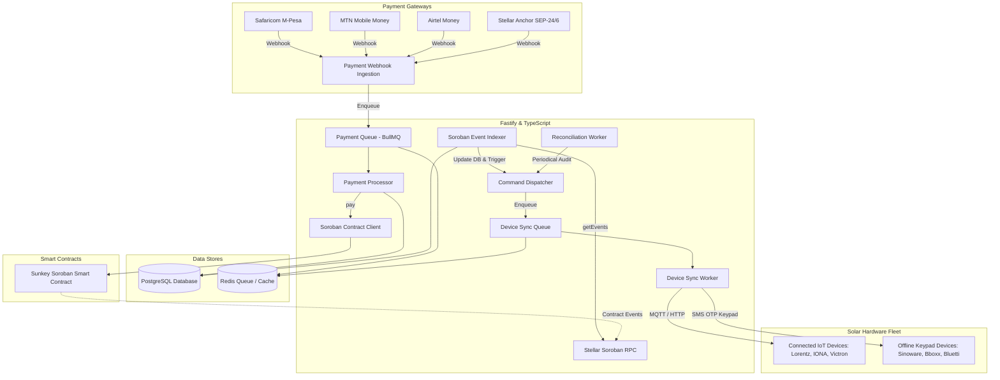

# Sunkey PaygEnergy — Device Bridge & Ingestion Engine

[](https://github.com/Sunkey-PaygEnergy/Payg-device-bridge/actions/workflows/ci.yml)
[](LICENSE)
[](https://www.typescriptlang.org/)
[](https://fastify.dev/)
[](https://stellar.org)

**Payg-device-bridge** is the high-performance off-chain hardware synchronization, payment ingestion, and Soroban contract indexer service powering the **Sunkey-PaygEnergy** solar platform.

It bridges off-grid clean energy hardware—both connected IoT devices over MQTT/HTTP and keypad-enabled offline devices utilizing the **OpenPAYGO Token Standard**—with authoritative smart contracts on the **Stellar network**.

---

## Architecture Overview



---

## Certified Hardware & Vendor Compatibility

The Sunkey device bridge integrates both connected IoT firmware and offline keypad standards according to the **OpenPAYGO Token Specification** (EnAccess Foundation & Solaris Offgrid):

| Hardware Vendor & Model | Hardware Type | Communication Protocol | Payload / Token Delivery |
| :--- | :--- | :--- | :--- |
| **Sinoware SunHome-Base 100** | Offline Keypad | OpenPAYGO Standard | 9-Digit Numeric OTP via SMS (`XXX-XXX-XXX#`) |
| **Victron Energy SHS200 MPPT** | Offline Keypad / Hybrid | OpenPAYGO Standard / VE.Direct | Monotonic HMAC OTP Keypad entry |
| **Bboxx Flexx40** | Offline Keypad | OpenPAYGO Standard | Monotonic HMAC OTP Keypad entry |
| **PowerOak / Bluetti (P150 / E40)** | Offline Keypad | OpenPAYGO Standard | 9-Digit Numeric Token (`XXX-XXX-XXX#`) |
| **IONA Home Max** | IoT Connected | MQTT & Cellular GSM | Signed JSON over MQTT (`sunkey/devices/+/cmd`) |
| **Lorentz S1-200 Solar Pump** | IoT Connected | Modbus / HTTP REST / MQTT | Cryptographically signed telemetry & relay control |
| **FOSERA & NIWA Systems** | Offline Keypad | OpenPAYGO Standard | Numeric token keypad entry |

---

## Security Model & Threat Mitigation Matrix

| Threat Category | Potential Attack Vector | Bridge Security Mitigation |
| :--- | :--- | :--- |
| **Hardware Tampering** | Customer bypasses load relay or modifies physical wiring | Real-time telemetry monitoring (`tamper_flag`, current/voltage discrepancies). Automatic flagging in reconciliation audits and repossession candidate lists. |
| **SMS Token Spoofing** | Attacker intercepts or fabricates activation SMS messages | All OpenPAYGO tokens are generated using unique 128-bit hardware keys derived from KMS root keys (`HKDF-SHA256`). Replay attacks are blocked by strict monotonic sequence counter enforcement. |
| **Fake Payment Ingestion** | Adversary sends bogus webhooks simulating M-Pesa / MTN payments | Strict HMAC-SHA256 signature verification, IP address whitelisting, and duplicate prevention via unique idempotency keys in PostgreSQL. |
| **Bridge Key Compromise** | Exposure of backend transaction signing keys | Bridge private keys are isolated using the Key Management Provider abstraction (`KMS / Vault / HSM`). Operations on Stellar are audited with structured Soroban events. |
| **Clock Drift & Timing Attacks** | Replay of old IoT telemetry packets or timing side-channels | Packets with timestamp skew > 300s are rejected. Constant-time comparison (`crypto.timingSafeEqual`) is used for all cryptographic signature checks. |

---

## API Reference

The service generates full OpenAPI / Swagger 3.0 documentation served at `/documentation`.

| Method | Endpoint | Description |
| :--- | :--- | :--- |
| `GET` | `/health` | Health check endpoint returning service status |
| `GET` | `/documentation` | Interactive Swagger UI API documentation |
| `POST` | `/api/v1/devices` | Register a new solar home device into the fleet |
| `POST` | `/api/v1/devices/:deviceId/assign-lease` | Bind physical hardware to an on-chain customer lease |
| `GET` | `/api/v1/devices/:deviceId` | Retrieve device hardware status, token counter, and lease details |
| `POST` | `/api/v1/devices/:deviceId/sync` | Trigger on-demand hardware state synchronization |
| `GET` | `/api/v1/fleet/health` | Overall fleet operational statistics and battery averages |
| `GET` | `/api/v1/fleet/devices` | Query devices with status filters and pagination |
| `GET` | `/api/v1/fleet/devices/:id/telemetry` | Historical telemetry records (voltage, solar input, watt-hours) |
| `POST` | `/api/v1/fleet/devices/:id/telemetry` | Authenticated HTTP ingestion for IoT hardware telemetry |
| `GET` | `/api/v1/risk/overdue` | Aging bucket report for overdue devices (1-7d, 8-30d, 31-90d, >90d) |
| `GET` | `/api/v1/risk/default-metrics` | Portfolio default rate, at-risk capital, and repossession eligibility |
| `GET` | `/api/v1/reports/repayment-curve/:id` | Cumulative payment curve vs expected payoff schedule |
| `GET` | `/api/v1/reports/fleet/csv` | Download comprehensive fleet state as CSV |
| `GET` | `/api/v1/reports/transactions/csv` | Export verified on-chain transactions as CSV |
| `GET` | `/api/v1/financier/pools/:poolId` | Read-only financier pool portfolio breakdown and recovery rate |
| `GET` | `/api/v1/financier/audit-trail` | Immutable audit trail logs for compliance and auditing |
| `POST` | `/api/v1/payments/webhooks/mpesa` | Safaricom M-Pesa C2B and STK Push payment webhook |
| `POST` | `/api/v1/payments/webhooks/mtn` | MTN Mobile Money payment webhook |
| `POST` | `/api/v1/payments/webhooks/airtel` | Airtel Money payment webhook |
| `POST` | `/api/v1/payments/webhooks/stellar-anchor` | Stellar Anchor (SEP-24 / SEP-6) deposit webhook |

---

## Local Development & Docker Compose

### Prerequisites
- Node.js `v24+` and npm
- Docker & Docker Compose

### 1. Clone & Install
```bash
git clone https://github.com/Sunkey-PaygEnergy/Payg-device-bridge.git
cd Payg-device-bridge
npm install
```

### 2. Configure Environment
```bash
cp .env.example .env
```

### 3. Start Database, Redis, MQTT & Bridge via Docker Compose
```bash
docker compose up -d
```

### 4. Run Migrations & Seed Demo Fleet
```bash
npm run db:seed
```

### 5. Run Test Suite
```bash
npm test
```

### 6. Build Production Bundle
```bash
npm run build
npm start
```
